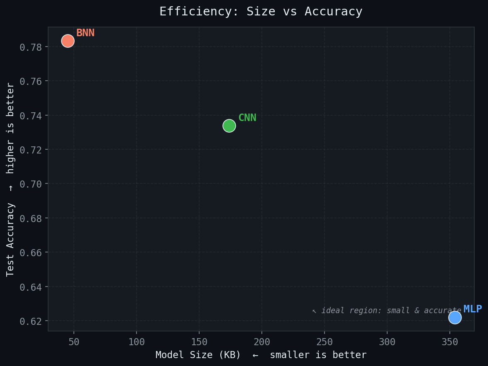
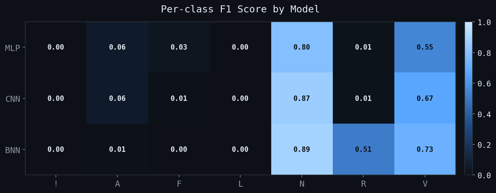

# binbeat 🫀

Benchmarking Binary Neural Networks against full-precision models for ECG arrhythmia 
classification on the MIT-BIH dataset. Trains three models (MLP, 1D-CNN, Quantized BNN),
evaluates them on a standard inter-patient split, and generates comparison plots for
accuracy, F1, model size, and inference time.

**Motivation:** 
Wearable heart monitors need to run on microcontrollers with kilobytes of 
RAM and no GPU. Full-precision models are too heavy. Binary Neural Networks quantize weights 
to low-bit integers, shrinking the model dramatically — but do they pay an accuracy cost?
This project answers that on real clinical data.

---

## Dataset

[MIT-BIH Arrhythmia Database](https://physionet.org/content/mitdb/1.0.0/) — 48 two-channel ECG
recordings, sampled at 360 Hz. Each heartbeat is segmented into a 187-sample window and labeled
with one of 7 arrhythmia classes.

**Inter-patient split** (DS1/DS2) is used throughout to prevent data leakage between train and test.

| Split | Samples | Records |
|-------|---------|---------|
| Train | 51,201  | 22      |
| Test  | 49,376  | 23      |

Classes: `N` (normal), `V` (ventricular), `R` (right bundle branch block), `A` (atrial premature),
`L` (left bundle branch block), `F` (fusion), `!` (ventricular flutter)

---

## Models

| Model | Architecture       | Precision | Params  | Size     |
|-------|--------------------|-----------|---------|----------|
| MLP   | 3-layer perceptron | Float32   | 90,826  | 354 KB   |
| CNN   | 3-block 1D-CNN     | Float32   | 44,682  | 174 KB   |
| BNN   | 3-block 1D-CNN     | Int8 (Brevitas) | 44,685 | **45 KB** |

BNN uses Brevitas 8-bit quantization on all intermediate layers.
First and last layers remain float32 (standard practice for stability).

---

## Results

| Model | Accuracy | F1 Macro | F1 Weighted | Size   | Inference   |
|-------|----------|----------|-------------|--------|-------------|
| MLP   | 0.622    | 0.206    | 0.626       | 354 KB | 0.0015 ms/sample |
| CNN   | 0.734    | 0.230    | 0.685       | 174 KB | 0.226 ms/sample  |
| **BNN** | **0.783** | **0.306** | **0.742** | **45 KB** | 0.252 ms/sample |

**BNN wins on every metric at 4× smaller than CNN and 8× smaller than MLP.**




### Honest note on class imbalance

All models struggle with minority classes (!, F, L) — class frequencies range from 472 to 74,525 samples.
The BNN uniquely recovers R (right bundle branch block) with F1=0.51 vs ~0.01 for MLP and CNN.
Future work: focal loss or SMOTE oversampling to improve minority class recall.

---

## Stack

- **PyTorch** — training and inference
- **Brevitas** — quantization-aware training
- **wfdb** — MIT-BIH signal parsing
- **scikit-learn** — evaluation metrics
- **matplotlib / seaborn** — benchmark plots

---

## Run it
```bash
git clone https://github.com/mohamedabdelfatah97/binbeat
cd binbeat
python -m venv .venv && source .venv/bin/activate
pip install torch brevitas wfdb numpy scikit-learn matplotlib seaborn tqdm

python scripts/download_data.py   # downloads MIT-BIH (~100 MB)
python scripts/preprocess.py      # segments heartbeats, applies DS1/DS2 split
python scripts/train_all.py       # trains all 3 models (~2.5 hrs on CPU)
python bin_main/evaluate.py       # generates results/metrics.json
python scripts/benchmark.py       # generates results/figures/
```

No GPU required.
